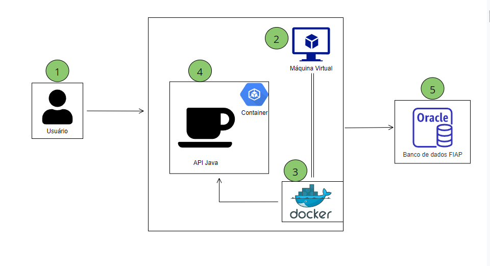

# Eco Track

Serviço de Validação de Consultas Odontológicas

### Link p/ apresentação da solução: https://www.youtube.com/watch?v=tvKSlDiB8sQ

### Link do video comprovando o funcionamento do App (DO ZERO): 

## Integrantes do Grupo

### Kauã Almeida Silveira
- **Responsável por:** API em Java Spring Boot, integração com o banco de dados Oracle, e API Python com Roboflow para visão computacional.
### Rafael Vida
- **Responsável por:** DevOps no Azure e QA, garantindo o pipeline de integração contínua e a qualidade do software.
### Gustavo Maia
- **Responsável por:** Desenvolvimento do App em Kotlin para Android e site em C#.

### ENTREGA DEVOPS INSTRUÇÕES

## AVISO IMPORTANTE - DEVOPS - ESTE PROJETO ESTÁ FUNCIONANDO PERFEITAMENTE NO AZURE
## E A API ESTÁ FUNCIONANDO E SE COMUNICANDO COM REQUISIÇÕES DE QUALQUER LUGAR
## O BANCO DE DADOS ORACLE ESTÁ HOSPEDADO EM UM SERVIDOR REMOTO DA FIAP
## TUDO ESTÁ FUNCIONANDO PERFEITAMENTE !!! 

- Construimos uma Dockerfile para a aplicação Spring Boot, e a aplicação foi dockerizada e publicada no Docker Hub.
- Na vm do Azure, foi logado no Docker Hub e a imagem foi baixada e rodada.
- Configuramos o Azure para liberar a porta 8080 para a aplicação Spring Boot.

## Como testar a aplicação

- O link para a aplicação rodando no Azure é: http://191.232.39.193:8080
- Para testar a aplicação, é necessário utilizar o Postman e importar a coleção de requisições.
- Exemplo de requisição: http://191.232.39.193/state
- Para testar a aplicação, é necessário realizar o login e obter o token JWT, e inseri-lo no Authorization das requisições, como bearer token.
- A aplicação está rodando no Azure, e o banco de dados Oracle está hospedado em um servidor remoto da FIAP.

